# Portfolio Forge Architecture Diagrams

This document contains visual representations of the Portfolio Forge system architecture using Mermaid diagrams.

## Table of Contents

- [System Overview](#system-overview)
- [Application Layers](#application-layers)
- [Authentication Flow](#authentication-flow)
- [API Request Flow](#api-request-flow)
- [AI System Architecture](#ai-system-architecture)
- [Portfolio Builder Flow](#portfolio-builder-flow)
- [Database Schema](#database-schema)
- [Component Hierarchy](#component-hierarchy)

---

## System Overview

High-level view of the Portfolio Forge system and external integrations.

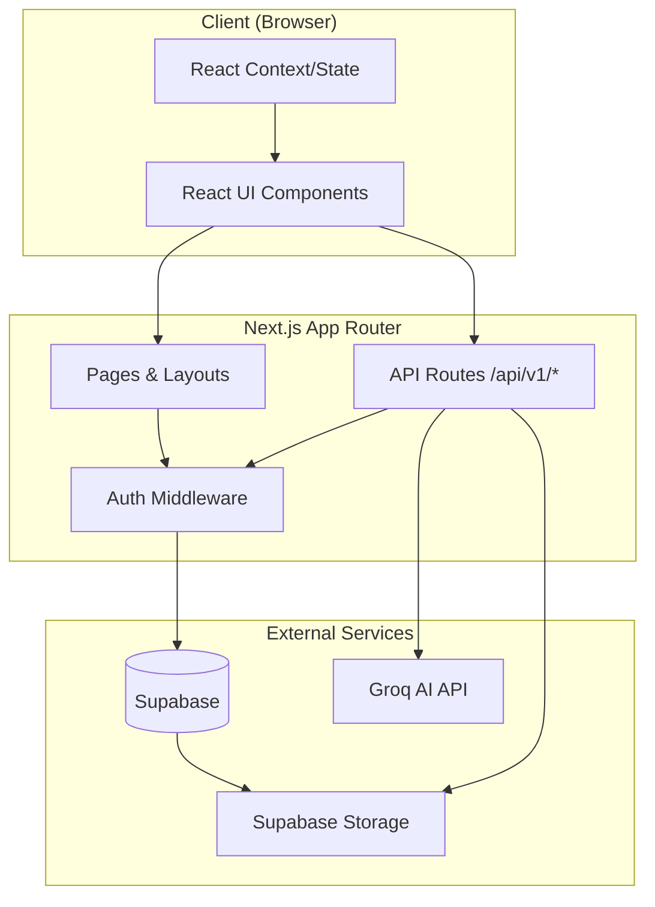

---

## Application Layers

The layered architecture of Portfolio Forge.

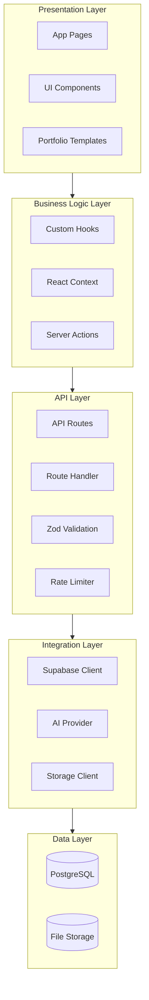

---

## Authentication Flow

OAuth authentication flow with Supabase.

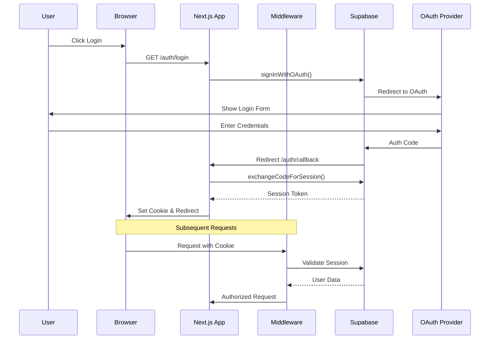

---

## API Request Flow

How API requests are processed through the middleware stack.

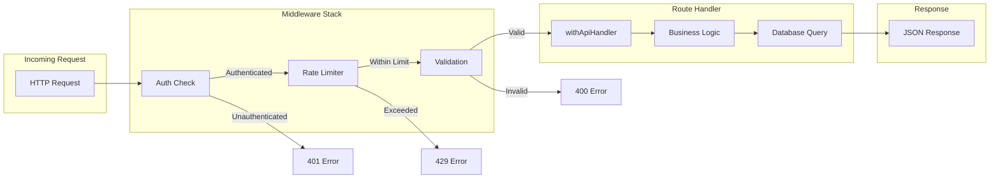

---

## AI System Architecture

The modular AI system with abilities and agents.

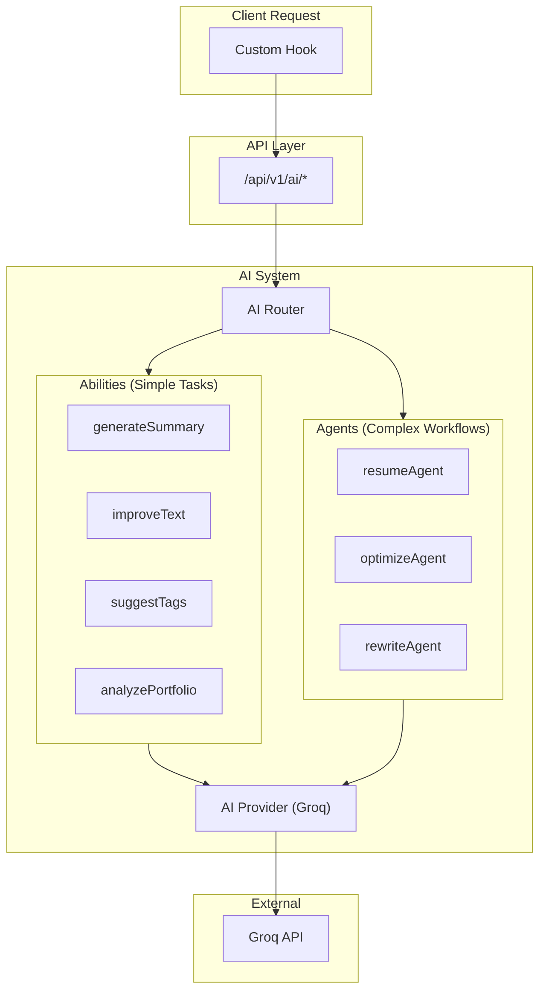

---

## Portfolio Builder Flow

User interaction flow in the Portfolio Builder component.

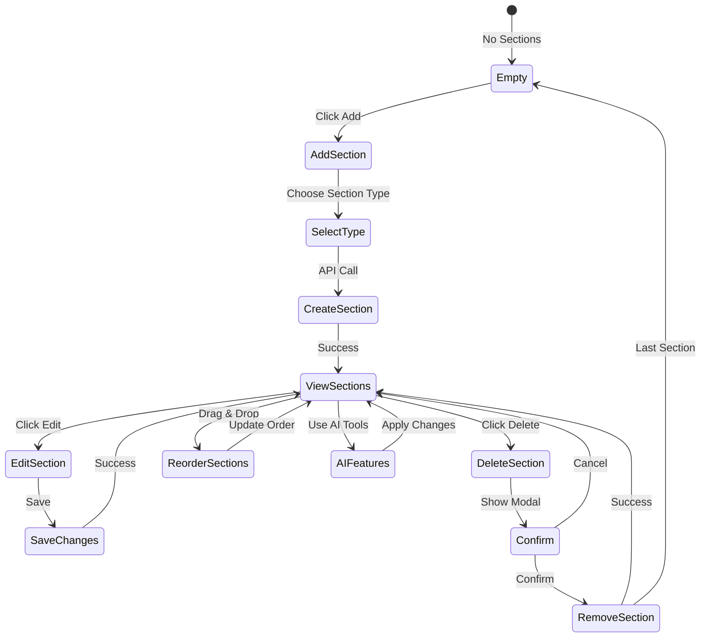

---

## Database Schema

Entity relationship diagram for the main database tables.

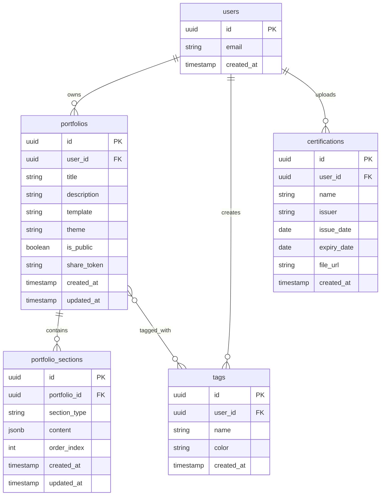

---

## Component Hierarchy

Main component structure of the application.

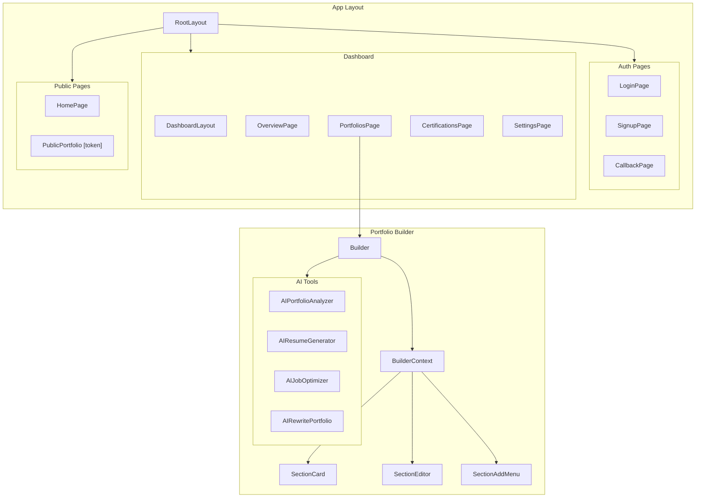

---

## Request Rate Limiting

How rate limiting is applied to different endpoint types.

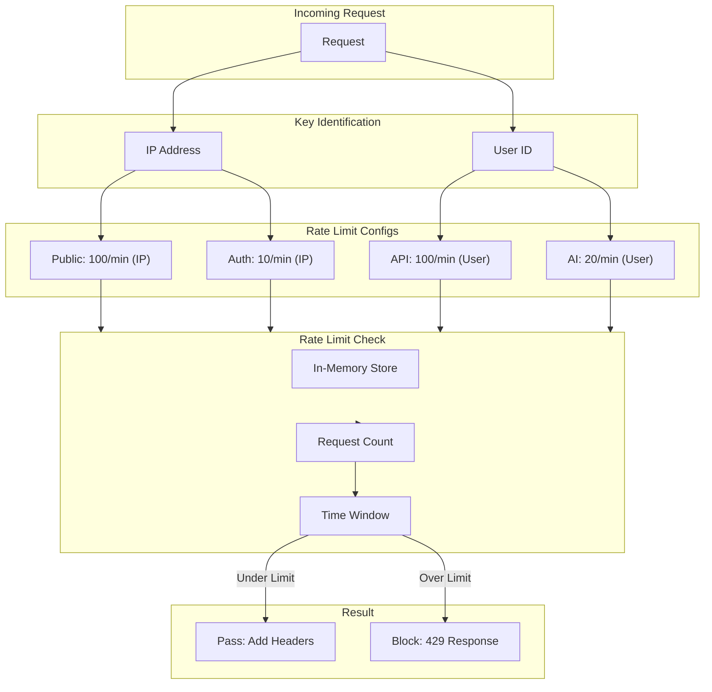

---

## File Upload Flow

Certification file upload process.

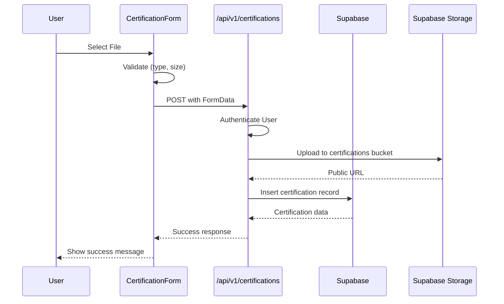

---

## Deployment Architecture

Production deployment on Vercel with Supabase.

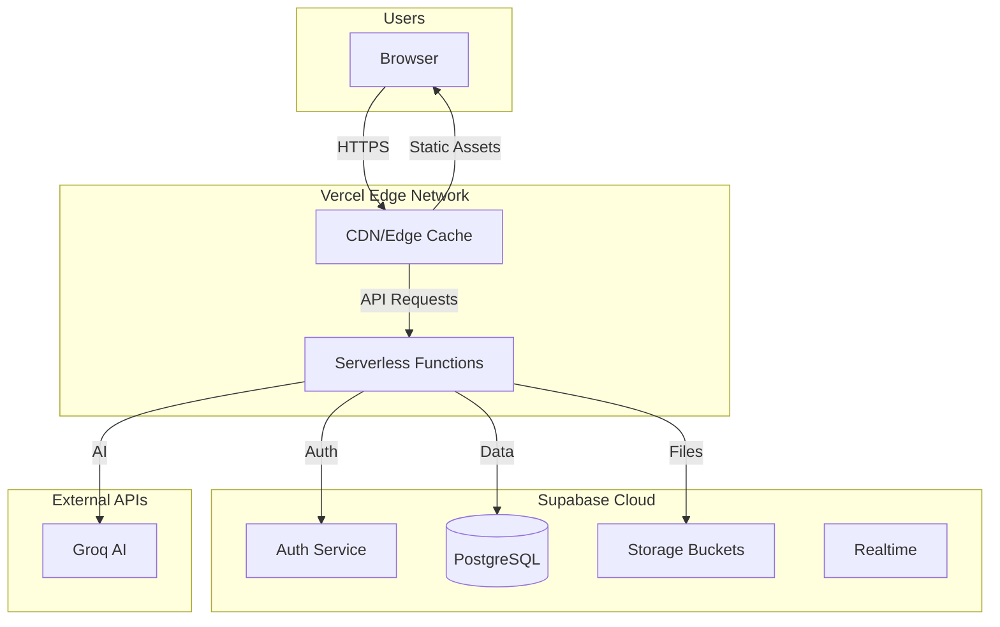

---

## Notes

- All diagrams use [Mermaid](https://mermaid.js.org/) syntax
- GitHub and VS Code natively render Mermaid diagrams
- For other platforms, use the [Mermaid Live Editor](https://mermaid.live/)
